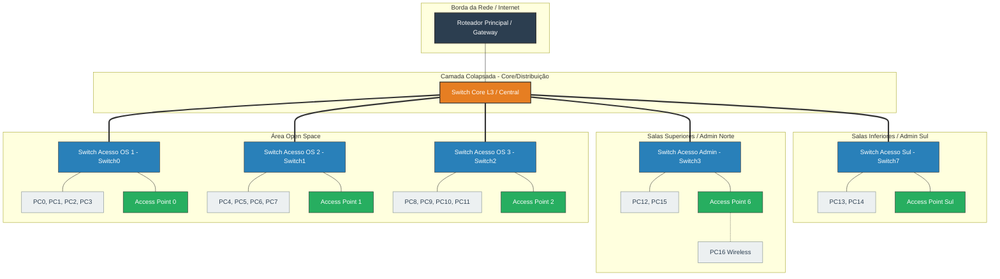

# Documentação de Arquitetura de Rede: Arquitetura Hierárquica Colapsada (Collapsed Core)

## 1. Visão Geral do Projeto

Este repositório contém a documentação técnica, diagramas estruturais em código (Mermaid) e a simulação de infraestrutura para uma rede corporativa baseada no modelo de **Arquitetura Hierárquica Colapsada** (*Collapsed Core Architecture*).

O projeto foi projetado com base em uma planta baixa física corporativa composta por:
- **Área Aberta (*Open Space*):** Composta por múltiplos clusters de estações de trabalho e pontos de acesso sem fio (*Access Points*).
- **Salas Administrativas / Reunião (Setor Norte):** Estações cabeadas e cobertura Wi-Fi dedicada.
- **Salas Individuais / Diretoria (Setor Sul):** Conectividade cabeada de alta disponibilidade e Ponto de Acesso local.

---

## 2. Arquitetura de Rede (*Collapsed Core*)

A topologia adota o modelo colapsado, no qual as camadas de **Core (Núcleo)** e **Distribuição** são fundidas em um único ponto central de alta performance (Switch Layer 3 / Core Switch). Esta abordagem otimiza custos, reduz a latência inter-VLAN e simplifica o gerenciamento sem comprometer a escalabilidade.

```
                    +-----------------------+
                    |    Roteador / Gateway  |
                    +-----------+-----------+
                                |
                    +-----------+-----------+
                    |    Switch Core (L3)   |
                    | (Core + Distribuição) |
                    +----+-----+-----+------+
                         |     |     |
         +---------------+     |     +---------------+
         |                     |                     |
+--------+-------+    +--------+-------+    +--------+-------+
|  Switch Acesso |    |  Switch Acesso |    |  Switch Acesso |
|   (Open Space) |    |  (Admin Norte) |    |   (Admin Sul)  |
+--------+-------+    +--------+-------+    +--------+-------+
         |                     |                     |
   +-----+-----+         +-----+-----+         +-----+-----+
   |           |         |           |         |           |
  PCs         APs       PCs         APs       PCs         APs
```

---

## 3. Diagrama Mermaid (Código)

Para visualizar ou editar o diagrama em ferramentas como **GitHub**, **Notion**, **Excalidraw**, ou **Mermaid Live Editor**, utilize o código abaixo:



---

## 4. Planejamento de Endereçamento IP e VLANs (Exemplo de Tabela)

| ID VLAN | Nome da VLAN | Sub-rede / CIDR | Descrição / Aplicação |
| :--- | :--- | :--- | :--- |
| **VLAN 10** | `ADM_MGMT` | `192.168.10.0/24` | Gerenciamento de Ativos (Switches, Roteadores) |
| **VLAN 20** | `CORP_DATA` | `192.168.20.0/24` | Estações de Trabalho Cabeadas (*Open Space* e Admin) |
| **VLAN 30** | `WIFI_CORP` | `192.168.30.0/24` | Dispositivos Móveis Corporativos via Wi-Fi |
| **VLAN 40** | `GUEST_WIFI` | `192.168.40.0/24` | Rede Visitantes (Isolada) |

---

## 5. Como Utilizar este Repositório

1. **Visualização do Diagrama:** O GitHub renderiza nativamente o bloco de código `mermaid` acima.
2. **Edição do Diagrama:** Copie o código do bloco `mermaid` e cole no [Mermaid Live Editor](https://mermaid.live) para exportar em PNG/SVG ou personalizar a estrutura.
3. **Simulação:** Utilize o arquivo de projeto no Cisco Packet Tracer para testar a conectividade e configurações de VLAN/Trunking.
