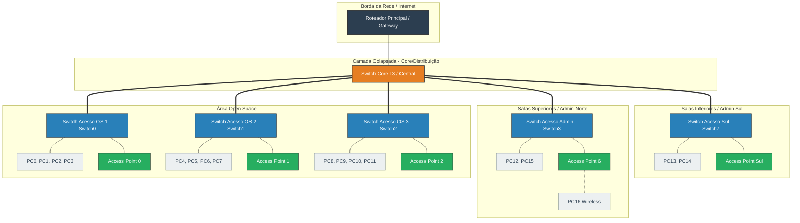

# Documentação de Arquitetura de Rede: Arquitetura Hierárquica Colapsada (Collapsed Core)

## 1. Visão Geral do Projeto

Este repositório contém a documentação técnica, diagramas estruturais em código (Mermaid) e a simulação de infraestrutura para uma rede corporativa baseada no modelo de **Arquitetura Hierárquica Colapsada** (*Collapsed Core Architecture*).

O projeto foi projetado com base em uma planta baixa física corporativa composta por:
- **Área Aberta (*Open Space*):** Composta por múltiplos clusters de estações de trabalho e pontos de acesso sem fio (*Access Points*).
- **Salas Administrativas / Reunião (Setor Norte):** Estações cabeadas e cobertura Wi-Fi dedicada.
- **Salas Individuais / Diretoria (Setor Sul):** Conectividade cabeada de alta disponibilidade e Ponto de Acesso local.

---

## 2. Arquitetura de Rede (*Collapsed Core*)

A topologia adota o modelo colapsado, no qual as camadas de **Core (Núcleo)** e **Distribuição** são fundidas em um único ponto central de alta performance (Switch Layer 3 / Core Switch). Esta abordagem otimiza custos, reduz a latência inter-VLAN e simplifica o gerenciamento sem comprometer a escalabilidade.

```
                    +-----------------------+
                    |    Roteador / Gateway  |
                    +-----------+-----------+
                                |
                    +-----------+-----------+
                    |    Switch Core (L3)   |
                    | (Core + Distribuição) |
                    +----+-----+-----+------+
                         |     |     |
         +---------------+     |     +---------------+
         |                     |                     |
+--------+-------+    +--------+-------+    +--------+-------+
|  Switch Acesso |    |  Switch Acesso |    |  Switch Acesso |
|   (Open Space) |    |  (Admin Norte) |    |   (Admin Sul)  |
+--------+-------+    +--------+-------+    +--------+-------+
         |                     |                     |
   +-----+-----+         +-----+-----+         +-----+-----+
   |           |         |           |         |           |
  PCs         APs       PCs         APs       PCs         APs
```

---

## 3. Diagrama Mermaid (Código)

Para visualizar ou editar o diagrama em ferramentas como **GitHub**, **Notion**, **Excalidraw**, ou **Mermaid Live Editor**, utilize o código abaixo:


```mermaid
graph TD
    classDef router fill:#2c3e50,stroke:#333,stroke-width:2px,color:#fff;
    classDef core fill:#e67e22,stroke:#333,stroke-width:2px,color:#fff;
    classDef accessSwitch fill:#2980b9,stroke:#333,stroke-width:1px,color:#fff;
    classDef ap fill:#27ae60,stroke:#333,stroke-width:1px,color:#fff;
    classDef host fill:#ecf0f1,stroke:#7f8c8d,stroke-width:1px,color:#2c3e50;

    subgraph WAN [Borda da Rede / Internet]
        Router[Roteador Principal / Gateway]:::router
    end

    subgraph CollapsedCore [Camada Colapsada - Core/Distribuição]
        CoreSwitch[Switch Core L3 / Central]:::core
    end

    Router --- CoreSwitch

    subgraph Setor_OpenSpace [Área Open Space]
        Sw_Access_OS1[Switch Acesso OS 1 - Switch0]:::accessSwitch
        Sw_Access_OS2[Switch Acesso OS 2 - Switch1]:::accessSwitch
        Sw_Access_OS3[Switch Acesso OS 3 - Switch2]:::accessSwitch

        AP0[Access Point 0]:::ap
        AP1[Access Point 1]:::ap
        AP2[Access Point 2]:::ap

        PCs_OS1[PC0, PC1, PC2, PC3]:::host
        PCs_OS2[PC4, PC5, PC6, PC7]:::host
        PCs_OS3[PC8, PC9, PC10, PC11]:::host

        Sw_Access_OS1 --- PCs_OS1
        Sw_Access_OS1 --- AP0
        Sw_Access_OS2 --- PCs_OS2
        Sw_Access_OS2 --- AP1
        Sw_Access_OS3 --- PCs_OS3
        Sw_Access_OS3 --- AP2
    end

    subgraph Setor_Admin_Norte [Salas Superiores / Admin Norte]
        Sw_Admin1[Switch Acesso Admin - Switch3]:::accessSwitch
        AP6[Access Point 6]:::ap
        PCs_Admin1[PC12, PC15]:::host
        PCs_WiFi_Norte[PC16 Wireless]:::host

        Sw_Admin1 --- PCs_Admin1
        Sw_Admin1 --- AP6
        AP6 -.- PCs_WiFi_Norte
    end

    subgraph Setor_Admin_Sul [Salas Inferiores / Admin Sul]
        Sw_Admin2[Switch Acesso Sul - Switch7]:::accessSwitch
        AP_Sul[Access Point Sul]:::ap
        PCs_Admin2[PC13, PC14]:::host

        Sw_Admin2 --- PCs_Admin2
        Sw_Admin2 --- AP_Sul
    end

    CoreSwitch === Sw_Access_OS1
    CoreSwitch === Sw_Access_OS2
    CoreSwitch === Sw_Access_OS3
    CoreSwitch === Sw_Admin1
    CoreSwitch === Sw_Admin2
```

---

## 4. Planejamento de Endereçamento IP e VLANs (Exemplo de Tabela)

| ID VLAN | Nome da VLAN | Sub-rede / CIDR | Descrição / Aplicação |
| :--- | :--- | :--- | :--- |
| **VLAN 10** | `ADM_MGMT` | `192.168.10.0/24` | Gerenciamento de Ativos (Switches, Roteadores) |
| **VLAN 20** | `CORP_DATA` | `192.168.20.0/24` | Estações de Trabalho Cabeadas (*Open Space* e Admin) |
| **VLAN 30** | `WIFI_CORP` | `192.168.30.0/24` | Dispositivos Móveis Corporativos via Wi-Fi |
| **VLAN 40** | `GUEST_WIFI` | `192.168.40.0/24` | Rede Visitantes (Isolada) |

---

## 5. Como Utilizar este Repositório

1. **Visualização do Diagrama:** O GitHub renderiza nativamente o bloco de código `mermaid` acima.
2. **Edição do Diagrama:** Copie o código do bloco `mermaid` e cole no [Mermaid Live Editor](https://mermaid.live) para exportar em PNG/SVG ou personalizar a estrutura.
3. **Simulação:** Utilize o arquivo de projeto no Cisco Packet Tracer para testar a conectividade e configurações de VLAN/Trunking.


# Simulação de Ambiente Hierárquico de Rede Local

Relatório prático referente à atividade de simulação de uma rede corporativa estruturada em camadas no **Cisco Packet Tracer**, contemplando escalabilidade, hierarquia, redundância e disponibilidade[cite: 1].

---

## 📋 Descrição do Projeto

Esta atividade consistiu na implementação física e estrutural de um cenário de rede dividido em três camadas principais[cite: 1]:

* **Camada de Núcleo (Core):** Contém um roteador com duas interfaces ligadas a dois switches de núcleo[cite: 1]. Os switches de núcleo possuem quatro conexões paralelas em GigabitEthernet para agregação de links de 4 Gbps[cite: 1].
* **Camada de Distribuição:** Os switches de núcleo foram conectados individualmente a dois switches de distribuição por meio de interfaces de fibra óptica multimodo (com caminhos redundantes em cruzamento) para agregação de links de 2 Gbps[cite: 1].
* **Camada de Borda (Access):** Composta por quatro switches de borda sem recursos de redundância[cite: 1].
* **Dispositivos Finais:** A rede integra quatro computadores desktops, quatro notebooks e um servidor central devidamente cabeados na camada de borda[cite: 1].

---

## 🚀 Testes de Conectividade e Validação 

Para garantir a comunicação lógica de ponta a ponta e validar o bônus da atividade[cite: 1], foi configurado o endereçamento IP estático na sub-rede `192.168.1.0/24` em todos os dispositivos finais. Abaixo estão as evidências e ênfases nos testes de `ping`:

### 1. Comunicação com o Servidor (`192.168.1.100`)
Os testes executados a partir das estações de trabalho e notebooks da borda em direção ao servidor comprovaram que o tráfego de rede atravessa perfeitamente as camadas de acesso, distribuição e núcleo com respostas bem-sucedidas.

> **Print / Evidência do Ping para o Servidor:**
> ```text
> [


 ]
> ```

### 2. Comunicação entre Desktops e Notebooks de Lados Opostos
Os pings cruzados realizados entre máquinas conectadas a switches de borda diferentes demonstraram a eficácia do encaminhamento de pacotes em toda a malha hierárquica da topologia.

> **Print / Evidência do Ping entre os Computadores/Laptops:**
> ```text
> [ 


]
> ```

---

## 📁 Arquivos do Projeto
* **`rede_hierarquica.pkt`**

```
